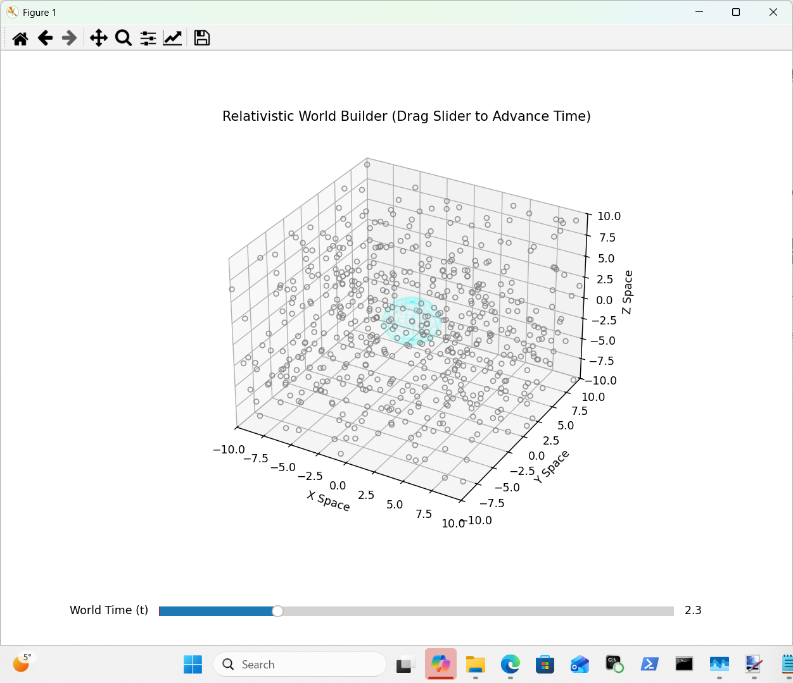

# 🚀 Quaternion World Builder  

### Relativistic Spacetime Engine for Neural Attention

A PyTorch-based generative system where **attention is governed by the laws of spacetime**.

Instead of arbitrary masking or positional encodings, this engine uses the **Minkowski metric** to enforce **causality** directly:

> Information can only flow inside the light cone.  
> Everything else is physically impossible — and mathematically removed.

---

## 🧠 Core Idea

This project demonstrates **Causal Sparsity**:

- No handcrafted masks  
- No learned positional embeddings  
- No cheating  

The network **naturally drops connections** between tokens that are **spacelike separated**.

Geometry defines connectivity.

---

## ⚙️ How It Works

### 1. Spacetime Representation

Each token is treated as an **event in 3+1D spacetime**:

(t, x, y, z)

---

### 2. Minkowski Interval (The Physics)

Pairwise relationships are computed using:

S_ij = (Δt)^2 - (Δx)^2 - (Δy)^2 - (Δz)^2

- S_ij ≥ 0 → Timelike (causally connected)  
- S_ij < 0 → Spacelike (forbidden)  

---

### 3. Light Cone Mask

Attention is restricted to:

M_ij = (S_ij ≥ 0) AND (Δt ≥ 0)

This enforces:

- No future influence  
- No faster-than-light communication  

---

### 4. Relativistic Attention

Standard attention:

A_ij = (Q_i · K_j) / sqrt(d)

Physics-enforced attention:

- Valid → keep score  
- Invalid → set to -inf  

Result:

- Sparse  
- Causal  
- Physically grounded  

---

### 5. World Propagation

A 3-layer network performs **causal message passing**:

- Information spreads only through valid spacetime paths  
- Max propagation distance = 3 causal “hops”  
- Equivalent to a **discrete wave propagation system**

---

## 🌌 The Simulation

### The Big Bang Setup

- 2500 random spacetime events  
- One seed event at the origin  
- Seed injects energy (RGB signal)  

The model computes:

The future light cone of that event.

---

### Visualization

Interactive 3D simulation:

- Slider = time evolution  
- Points = spacetime events  
- Color = received energy  
- Wireframe = expanding light cone  

Inside cone → activated nodes  
Outside cone → vacuum  

---

## 🔬 Why This Matters

### Geometry-Driven Attention
No arbitrary masking. Connectivity emerges from spacetime structure.

### Built-in Causality
The model cannot use future information.

### Interpretability
The causal mask is a direct graph of influence.

### Physical Inductive Bias
Useful for:

- Physics simulations  
- Event streams  
- Robotics  
- Spatiotemporal prediction  

### Efficient Sparsity
Connections scale with light cone volume, not full N².

---

## ▶️ Running the Demo

python your_script_name.py

---

## 🔮 Future Directions

- Learn spacetime coordinates  
- Extend to curved spacetime  
- Differentiable Lorentzian kernels  
- Scale to transformers  

---

## 📂 Repository

https://github.com/anttiluode/MatrixBetaV0.87A/

---

## 🧬 Tagline

The universe is not fully connected — and neither should your neural network be.
